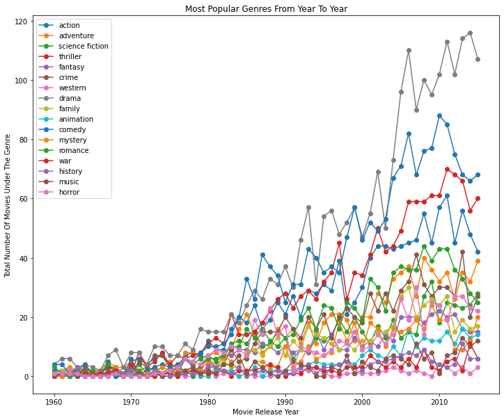

# Investigate-a-Dataset
 This is my submission for Udacity's project on Introduction to Data Analysis.

## Introduction
In this project I analyzed a movie dataset to get some insights about the nature of movies stored on the database of TMDb movies to get insights that could be insightful to streaming companies and movie production company executives.

## Dataset Description
The data set I used contains information of about 10,000 movies collected from The Movie Database (TMDb). The dataset also includes specific movie attributes like its user ratings, popularity ratings, release year and revenue generated.

## Question(s) for Analysis
> What are the features of popular movies?

> Which genres are most popular from year to year?

view my [code](https://github.com/GilbertReviews/Investigate-a-Dataset/blob/main/Gilbert_Project_Notebook.ipynb) 
